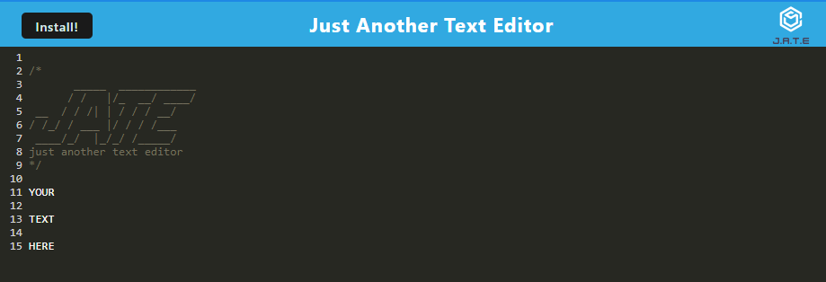

# TextEditorPWA

## Description

A text editing progressive web application.

[Link to TextEditor Page](https://justanotherjate-986e7e2713a4.herokuapp.com/)

[Link to Respository Page](https://github.com/Yajiit/TextEditorPWA)

## Table of Contents

- [Installation](#installation)
- [Usage](#usage)
- [License](#license)
- [Questions](#questions)

## Installation

Run npm install with the package.json for the required node modules. To install the client application locally click the Install button in the top left and follow the prompt.

## Usage

Simply enter text into the application and it will automatically store whenever the user clicks off of the window.

## License

This project is licensed under the [MIT License](https://opensource.org/licenses/MIT).

## Questions

Additional questions: please visit (https://github.com/Yajiit)

